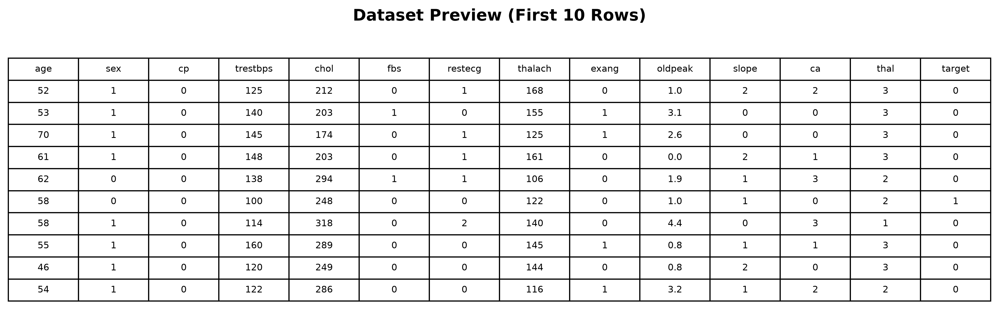
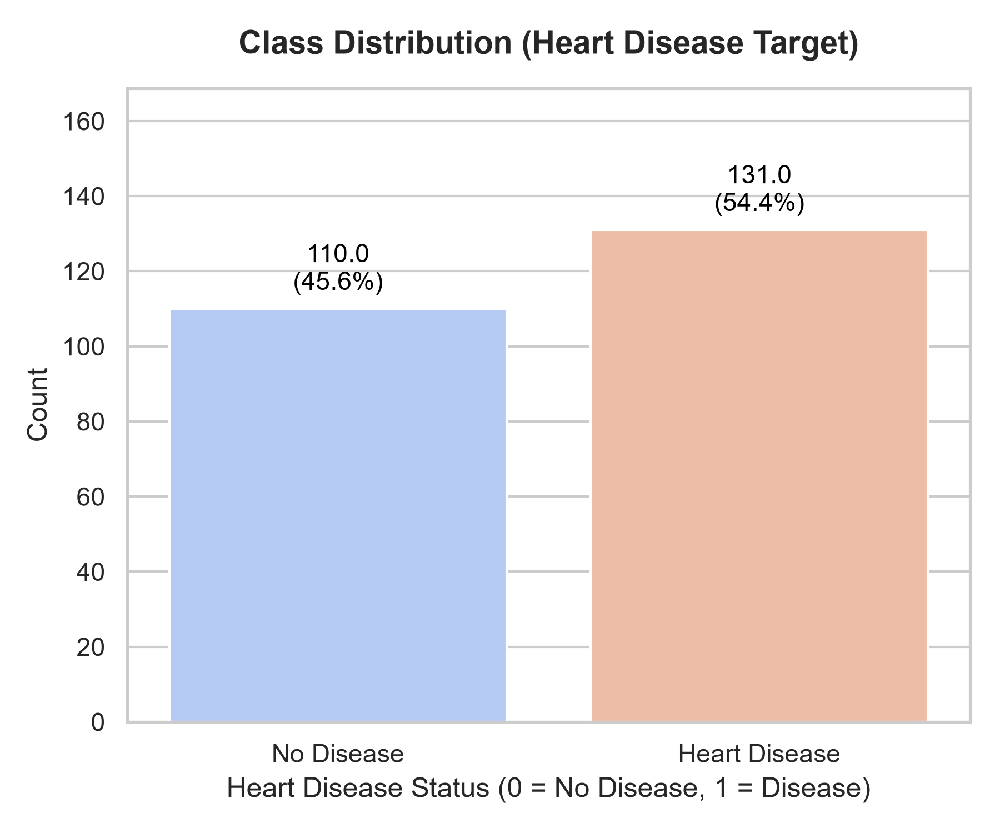
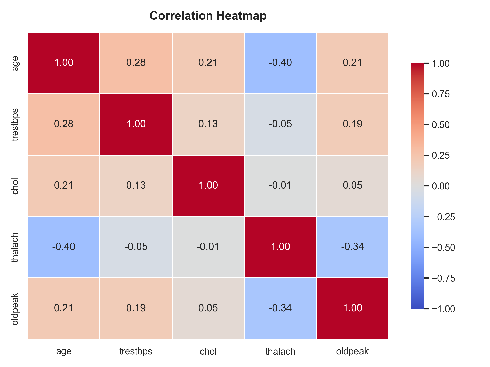
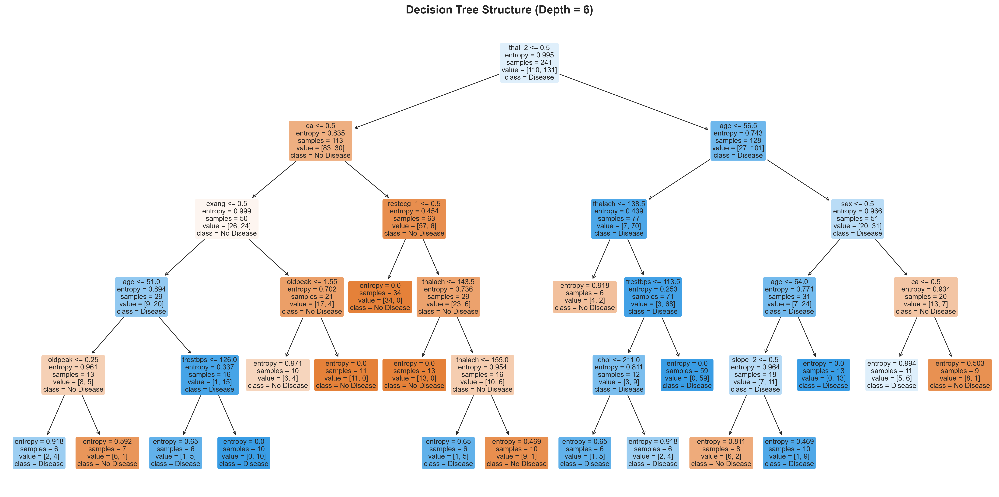
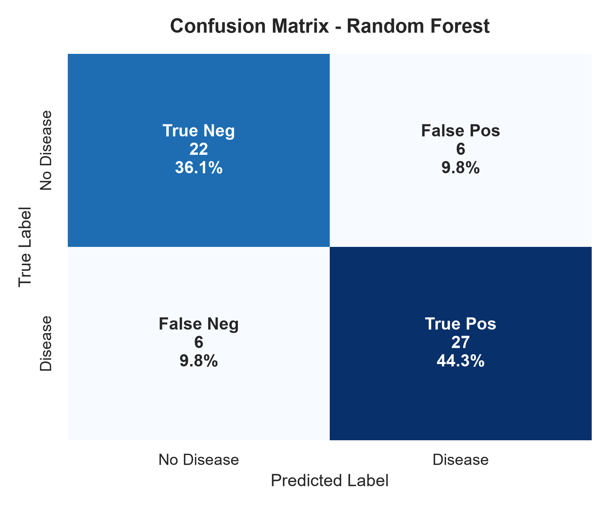
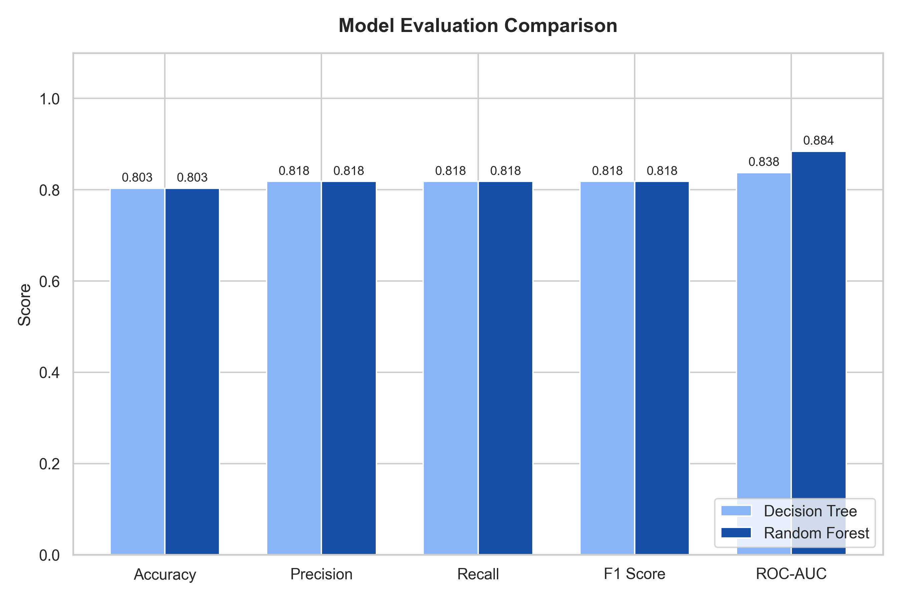
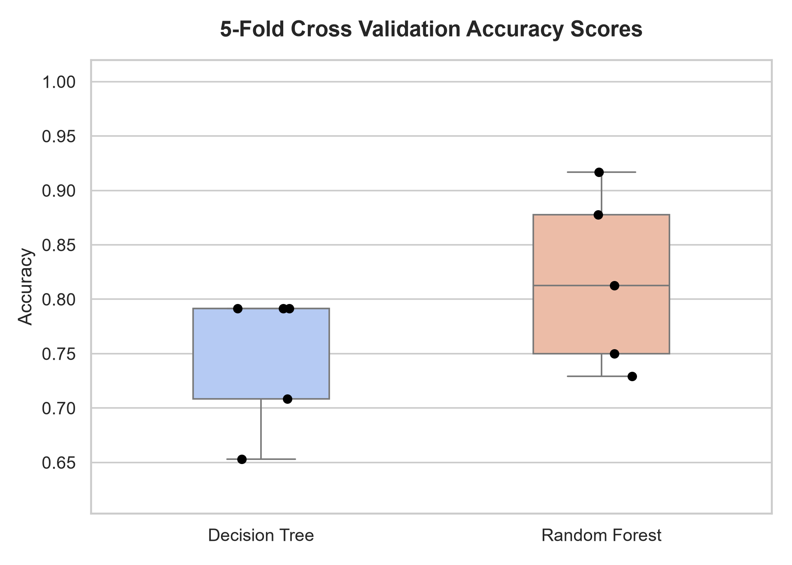
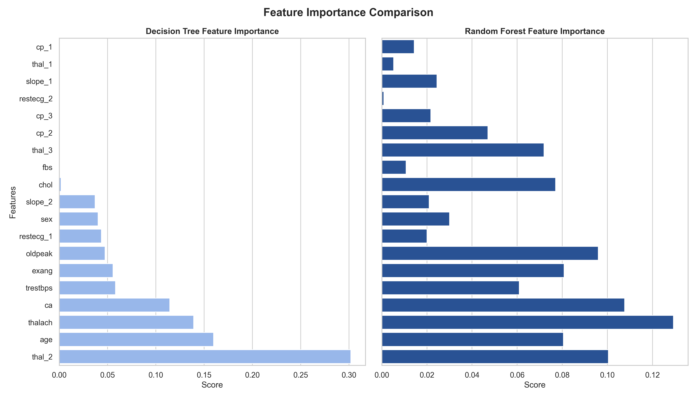

# Heart Disease Prediction using Decision Trees & Random Forests

This repository contains a production-ready machine learning pipeline that classifies whether a patient has heart disease based on clinical diagnostic measurements. The project contrasts a single **Decision Tree Classifier** with an ensemble **Random Forest Classifier**, applying grid search optimization, cross-validation, feature importance analysis, and rigorous data leakage mitigation.

---

## 📋 Executive Project Summary
* **Target Objective**: Classify heart disease presence (1 = diseased, 0 = healthy).
* **Data Leakage Resolution**: Identified and resolved a massive data duplication issue (1,025 raw rows reduced to 302 unique patient profiles), safeguarding validation integrity.
* **Model Highlights**:
  * While both models achieved **80.33% Accuracy** on a small holdout test set (61 cases), the **Random Forest** proved significantly more robust.
  * **Random Forest** achieved a **ROC-AUC of 88.42%** (vs. 83.77% for the Decision Tree) and a **5-Fold Cross-Validation Accuracy of 81.72%** (vs. 74.73% for the Decision Tree), demonstrating superior generalization and class separation.
  * Clinical traits like `thal` (thalassemia) and chest pain type (`cp`) were identified as the strongest predictors.

---

## 🛠️ Technology Stack & Environment
* **Language**: Python 3.11+
* **Core Libraries**: `pandas`, `numpy`, `scikit-learn`
* **Visualization**: `matplotlib`, `seaborn`
* **Serialization**: `joblib`
* **Development**: Jupyter Notebook (`nbformat`, `nbconvert`)

---

## 📁 Repository Structure
```
ElevateLabs-Task-05-Decision-Trees-Random-Forests/
│
├── dataset/
│   └── heart_disease.csv                 # Preprocessed unique patient records
│
├── notebooks/
│   └── decision_tree_random_forest.ipynb # Complete narrative analysis notebook (pre-rendered)
│
├── images/                               # High-quality figures and plots
│   ├── dataset_preview.png
│   ├── class_distribution.png
│   ├── correlation_heatmap.png
│   ├── decision_tree.png
│   ├── confusion_matrix_dt.png
│   ├── confusion_matrix_rf.png
│   ├── feature_importance.png
│   ├── model_comparison.png
│   └── cross_validation_scores.png
│
├── models/                               # Serialized model pickle files
│   ├── decision_tree.pkl
│   └── random_forest.pkl
│
├── outputs/                              # Pipeline text logs and predictions
│   ├── predictions_dt.csv
│   ├── predictions_rf.csv
│   └── evaluation_metrics.txt
│
├── decision_tree_random_forest.py       # Production pipeline execution script
├── requirements.txt                     # Package dependencies
├── README.md                            # Comprehensive project overview
├── LICENSE                              # MIT License
└── .gitignore                           # Git ignore configurations
```

---

## 📊 Preprocessing & Methodology

### 1. Data Audit & Leakage Prevention
The raw `heart.csv` file has **1,025 rows**. However, the original study only recorded **303 patients**. The remaining 722 rows are exact duplicates resampled into the dataset. 
Splitting a resampled dataset into training and test splits *before* dropping duplicates leads to severe **data leakage** because identical records end up in both splits. We removed all duplicates, resulting in **302 unique patient profiles** (164 heart disease, 138 healthy).

### 2. Categorical Variable Handling
We one-hot encoded nominal categorical features (`cp` - chest pain type, `restecg` - resting ECG, `slope` - exercise ST segment slope, `thal` - thalassemia). Scikit-learn treats numerical integer features as continuous; one-hot encoding prevents the tree algorithm from assuming ordinal relationships where none exist.

### 3. Tree Scale Invariance
No feature scaling was applied. Decision Trees and Random Forests split variables based on thresholds, making them scale-invariant. Omitting scaling preserves feature interpretability.

---

## 📈 Model Performance & Comparison

The models were optimized using Grid Search with 5-Fold Stratified Cross-Validation on the training set:
* **Decision Tree Optimized**: `{'criterion': 'entropy', 'max_depth': 6, 'min_samples_leaf': 6}`
* **Random Forest Optimized**: `{'n_estimators': 150, 'max_depth': 7, 'bootstrap': True}`

### Metric Scorecard
| Metric | Decision Tree Classifier | Random Forest Classifier | Performance Delta |
| :--- | :---: | :---: | :---: |
| **Accuracy** | 80.33% | 80.33% | 0.00% (Identical) |
| **Precision** | 81.82% | 81.82% | 0.00% (Identical) |
| **Recall** | 81.82% | 81.82% | 0.00% (Identical) |
| **F1-Score** | 81.82% | 81.82% | 0.00% (Identical) |
| **ROC-AUC** | **83.77%** | **88.42%** | **+4.65% (RF Superior)** |
| **Mean CV Accuracy** | **74.73%** | **81.72%** | **+6.99% (RF Superior)** |

*Analysis Note*: Although test set accuracies are identical due to the small size of the holdout split (61 samples), Random Forest's significantly higher ROC-AUC and Cross-Validation scores verify that it generates stronger, more generalizable class separation.

---

## 🎨 Visualization Gallery

Here are the key visualization diagrams generated by the machine learning pipeline:

### 1. Data Audit & EDA Previews
* **Dataset Preview Table**:
  
* **Target Class Distribution**:
  
* **Correlation Matrix (Continuous Features)**:
  

### 2. Decision Tree Structure
* **Pruned Decision Tree Visualization**:
  

### 3. Confusion Matrices
* **Decision Tree Classifier Confusion Matrix**:
  
* **Random Forest Classifier Confusion Matrix**:
  

### 4. Model Comparison & Feature Importances
* **Performance Metrics Comparison**:
  
* **5-Fold Cross-Validation Scores Boxplot**:
  
* **Feature Importances Comparison**:
  

---

## 🚀 How to Run

### 1. Installation
Clone the repository and install dependencies:
```bash
pip install -r requirements.txt
```

### 2. Run the ML Pipeline
Execute the Python script to preprocess the data, train both models, save visual plots, and output predictions:
```bash
python decision_tree_random_forest.py
```

### 3. Open the Notebook
To view the detailed theoretical breakdown and interactive visualizations, open the notebook:
```bash
jupyter notebook notebooks/decision_tree_random_forest.ipynb
```

---

## 👥 Author
* **ML Engineering Candidate**
* **Project Reference**: Task 5 - Decision Trees & Random Forests Audit

## 📄 License
This project is licensed under the MIT License - see the [LICENSE](LICENSE) file for details.
